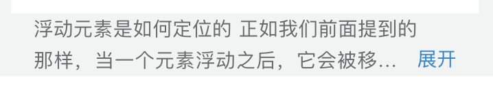

#### 作者

雍正

#### 组件介绍

用于文本框的`展开`\*`收起`功能。

#### 组件缩略图



#### 使用

```
<sp-text-expand-collapse text="文本内容" lineNum="3" />
```

#### Props

| 参数    | 类型   | 默认值 | 可选项 | 备注             |
| ------- | ------ | ------ | ------ | ---------------- |
| text    | string | ''     | -      | 文本内容         |
| lineNum | string | 2      | 数字   | 多少行展示省略号 |

#### Methods

| 方法名 | 参数 | 返回值 | 备注 |
| ------ | ---- | ------ | ---- |
| -      |      |        |      |

#### Slot

| name | 说明 |
| ---- | ---- |
| -    |      |
